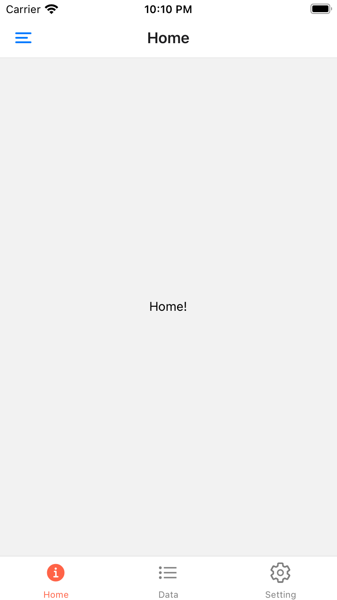
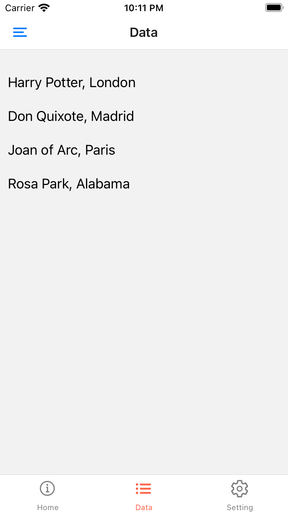
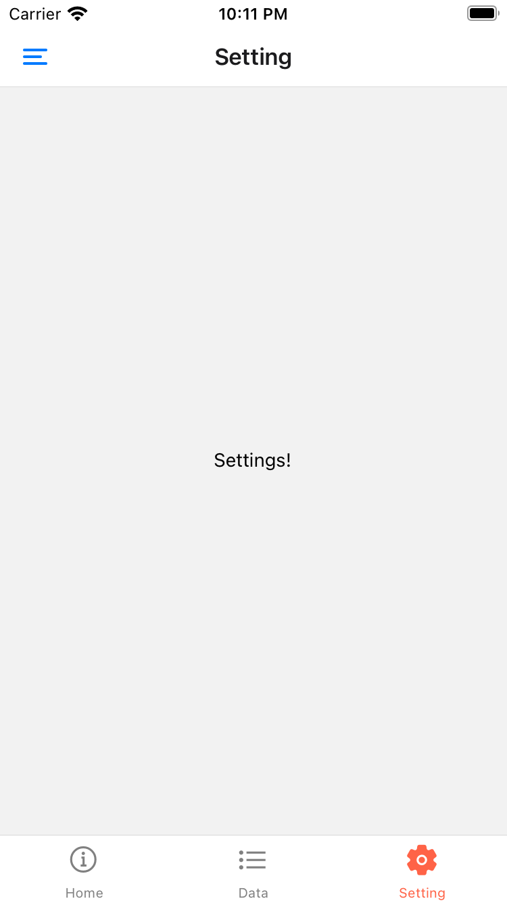
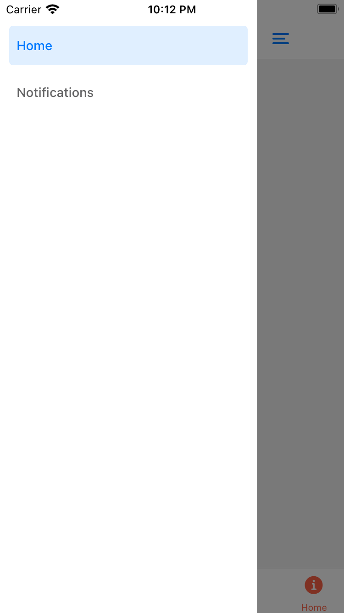

# React Native 測試

## 簡介
以 `` expo-cli `` 建立專案與開發環境，

並以 iOS Simulator 進行實時確認。

## 架構
由於說明中無回到前一分頁的要求，因此將 iOS 預設 *上一頁功能* 的位置改為拉出的清單。

整體結構與產出時間如下：

- `` Drawer.Navigator: 2hr ``
    - `` Tab.Navigator: 4hr ``
        - Home: 10min
        - Data: 15min
        - Setting: 5min
    - Notifications: 5min

## Demo

  
  
  
  
  

 

### 參考文件：
- [React Native](https://reactnative.dev/docs/getting-started)
- [React Navigation](https://reactnavigation.org/docs/getting-started)
- [Expo vector-icons](https://icons.expo.fyi/)

